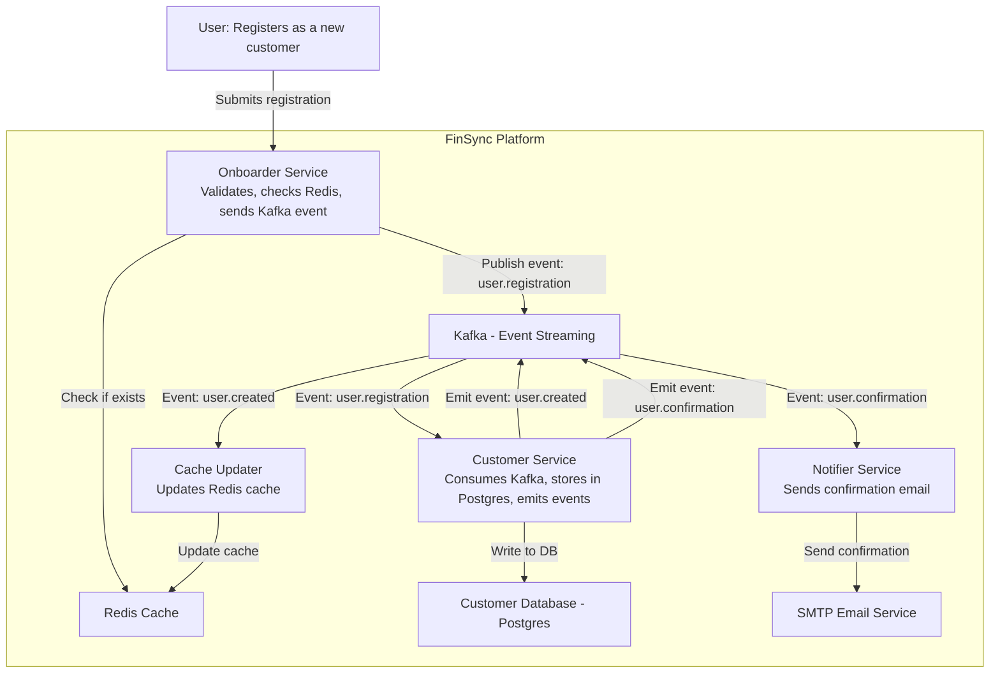

🏯 Jade Palace

## 💼 Business Context: "FinSync: Scalable Customer Onboarding System"

FinSync is a fast-growing digital financial service platform that offers investment, wallet, and lending solutions across Southeast Asia.
The company is launching a major marketing campaign and expects a surge in new customer sign-ups. To support this, they need a system that can:
Handle thousands of new registrations each day without slowing down.
Quickly and accurately collect customer information.
Allow internal staff to review, update, and manage user data easily.
Keep the system secure, reliable, and ready to grow.
Help the company track what’s happening in real time and fix issues quickly.

# 5 Weeks of Practices to build real system

## Week 1: Provide the API for registration

**Objective:**
Provide an API for registration that can be used by the frontend or other systems to register new customers.

<details>
<summary>Business Requirements</summary>
- Create a registration API that allows new customers to sign up.
- The API should accept customer information such as name, email, phone number and ID.
- Validate the input data to ensure it meets the required format and criteria.
   - name: 2 - 200 characters
   - email: valid email format
   - phone number: valid phone number format
   - ID: valid ID format
- Customers should receive a confirmation email after successful registration.
- High availability is a must
- The system should be able to handle a large number of concurrent requests without crashing or slowing down.
</details>

<details>
<summary>Technical Requirements</summary>

## Overview

- Use a RESTful API design for the registration endpoint.
- Implement input validation using Go with the Gin framework.
- Unit test the API to ensure it works as expected.
- Integration test the API to ensure it works with the database and email service.
- Use a relational database PostgreSQL to store customer information.
- Use Kafka for message queuing to handle high traffic.

## API Design specification

- Endpoint: POST /api/v1/register
  - Request Body:

        ```json
        {
            "name": "string",
            "email": "string",
            "phoneNumber": "string",
            "thaiID": "string"
        }
        ```

  - Response:

        ```json
        {
        "status": "success",
        "message": "Registration successful",
        "data": {
                "customerID": "string"  // Generated unique customer ID
            }
        }
        ```

  - Error Response:

        ```json
        {
            "status": "error",
            "message": "Invalid input data"
        }
        ```

  - Validation:
    - Name: 2 - 200 characters
    - Email: valid email format
    - Phone Number: valid phone number format
    - Thai ID: valid Thai ID format

  - Confirmation Email:
    - Send a confirmation email to the customer after successful registration.
    - Use a third-party email service provider (e.g., SendGrid, Mailgun) to send emails.
    - Email template should include:
      - Subject: "Welcome to FinSync!"
      - Body: "Thank you for registering with FinSync. Your customer ID is {customerID}."
    - Use a message queue (e.g., Kafka) to handle email sending asynchronously.

## System Architecture

- The system will consist of multiple microservices:
  - **Onboarder Service**: Handles the registration process and validates input data.
  - **Customer Service**: Stores customer information in a PostgreSQL database.
  - **Notifier Service**: Sends confirmation emails to customers.
  - **Cache Updater**: Updates the Redis cache with the latest user data.
  - **Redis**: Used for caching customer data to improve performance.

| Layer     | Service Name      | Role                                                                    |
|-----------|-------------------|-------------------------------------------------------------------------|
| API       | onboarder-service | Receives registration requests, validates input, and publishes to Kafka |
| DB Writer | customer-service  | Saves customer information to DB, triggers follow-ups                   |
| Email     | notifier-service  | Sends confirmation emails to customers after successful registration    |
| Cache     | cache-updater     | Maintains user Redis cache                                              |

"onboarder-service" will be the entry point for user registration and will validate the input data. If the data is valid, it will publish a message to Kafka for further processing and store the data in Redis cache for quick access check duplicates with status "processing".

The "customer-service" will listen to the Kafka topic and persist the data to PostgreSQL.

The "notifier-service" will also listen to the Kafka topic and send confirmation emails to customers.

The "cache-updater" will update the Redis cache with the latest user data upon successful creation.

The "customer-service" will listen to the Kafka topic and persist the data to PostgreSQL.

The "notifier-service" will also listen to the Kafka topic and send confirmation emails to customers.



## Database Design

- Use PostgreSQL as the database to store customer information.
- Create a table named "customers" with the following schema:

```sql
CREATE TABLE customers (
    id SERIAL PRIMARY KEY,
    name VARCHAR(200) NOT NULL,
    email VARCHAR(255) UNIQUE NOT NULL,
    phone_number VARCHAR(20) NOT NULL,
    thai_id VARCHAR(20) UNIQUE NOT NULL,
    created_at TIMESTAMP DEFAULT CURRENT_TIMESTAMP
);
```

## Customer Service

- Consume the Kafka topic "user.registration" to process registration events.
- Validate the data and store it in the PostgreSQL database.
- Emit events to Kafka for confirmation and cache updates.

</details>

## Week 2: Provide UI for Admin to manage users
**Objective:**
Provide a UI for internal staff to manage users, including viewing, updating, and deleting user information.
<details>
<summary>Business Requirements</summary>
- Create a web-based UI for internal staff to manage users.
- The UI should allow staff to view a list of registered users.
- Staff should be able to view user details, including name, email, phone number, ID and registration date.
</details>

<details open>
<summary>Technical Requirements</summary>

## Overview

- Use a Next.js framework for the UI.
- Use Tailwind CSS for styling.
- UI should be responsive and user-friendly.
- Implement authentication and authorization for staff access.

## UI Design
- Create a dashboard page that displays a list of registered users.
- Each user entry should include:
  - Name
  - Email
  - Phone Number
  - Thai ID
  - Registration Date
- Provide a search bar to filter users by name or email.

## NOTE

- Techinique : Vertical slice / incremental delivery for each sprint
- Rate Limiting: 100 requests per minute per IP address

🎯 The Goal for the Team:
Your team is hired to design and build this customer onboarding system.
It must be:

Feature | Description
Dead-letter Queue | Retry or log failed Kafka messages (e.g., broken DB or email)
Schema Registry | Validate event structure between services
Trace ID Middleware | Add correlation IDs for tracing requests across microservices
API Gateway (e.g., Kong) | Route and secure external access

```yaml
version: v1
services:
  onboarder-service:
    description: |
      Entry point for user registration. Validates input, checks Redis cache,
      and publishes to Kafka if user does not exist.
    endpoints:
      - POST /register
    dependencies:
      - redis
      - kafka (topic: user.registration)

  user-store-service:
    description: |
      Listens to registration events, validates and persists data to Postgres.
      Publishes confirmation and cache update events.
    kafka:
      consume:
        - topic: user.registration
      produce:
        - topic: user.created
        - topic: user.confirmation
    dependencies:
      - postgres
      - kafka

  notifier-service:
    description: |
      Sends confirmation emails to users after registration is successful.
    kafka:
      consume:
        - topic: user.confirmation
    dependencies:
      - smtp (or 3rd-party email provider)

  cache-updater:
    description: |
      Updates Redis cache with the latest user data upon successful creation.
    kafka:
      consume:
        - topic: user.created
    dependencies:
      - redis

infrastructure:
  kafka:
    topics:
      - user.registration
      - user.created
      - user.confirmation
  redis:
    ttl_minutes: 15
  postgres:
    schema: users
  smtp:
    provider: mailgun
```

Fast — can handle high traffic smoothly

Reliable — no data loss, no crashes

Easy to use — both for new customers and internal staff

Secure — protects personal information and login access

Scalable — ready to support millions of users as the business grows

👩‍🏫 Why This Matters:
This registration system is the front door of the business.
If it fails, FinSync loses customers, revenue, and trust.

Your job is to make sure that doesn’t happen.

Quick facts:
Located on top of Jade Mountain (overlooking the Valley of Peace)

Home of:

Master Oogway 🐢

Master Shifu 🐼

The Furious Five 🐯🐵🐍🐶🐞

Holds the Dragon Scroll 🐉

Sacred dojo of Kung Fu learning and wisdom
