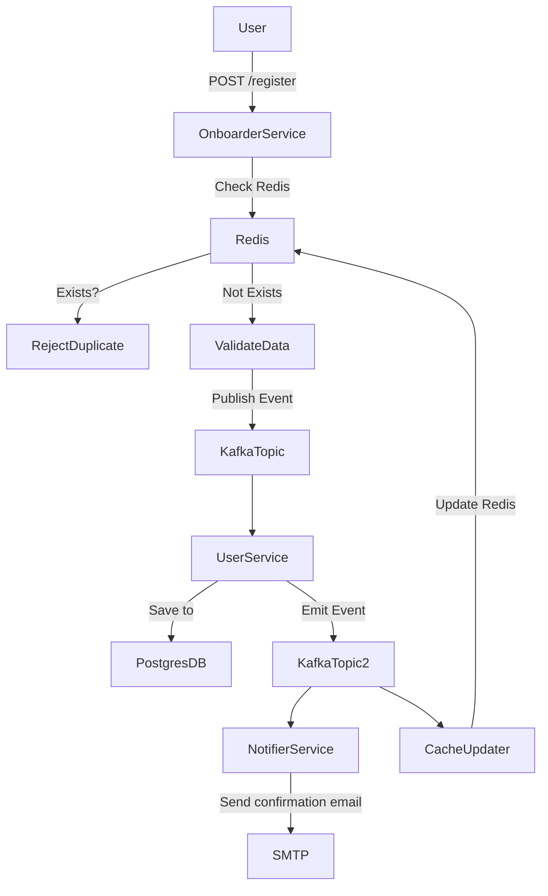
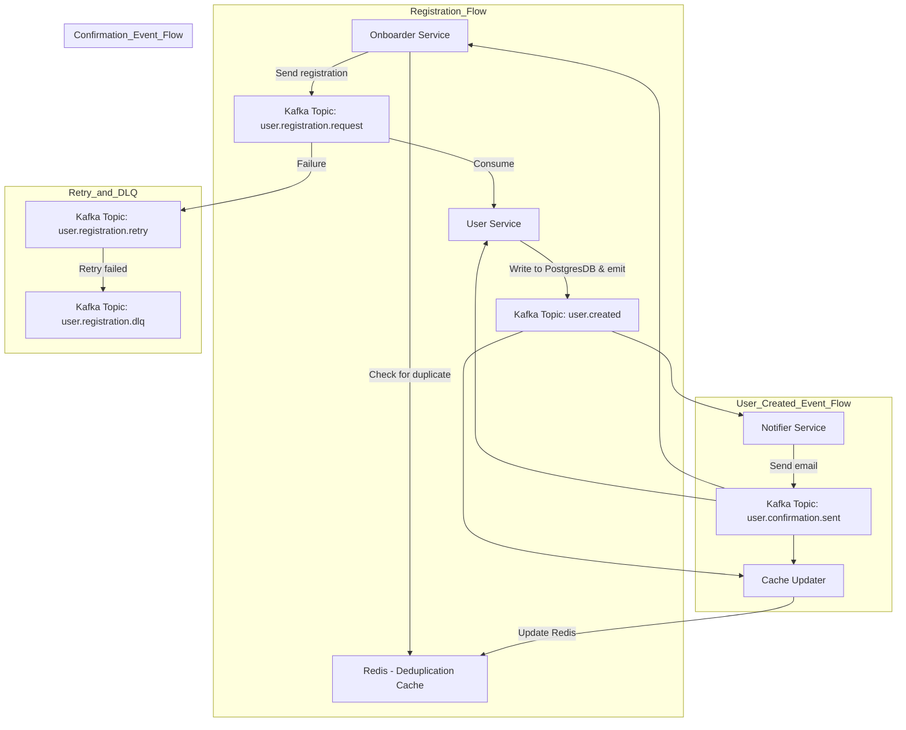
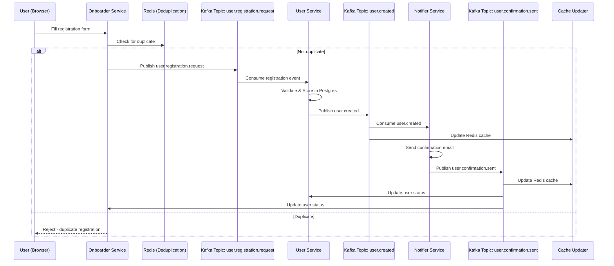
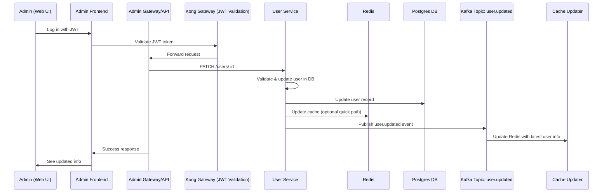

# 🏯 Jade Palace - 5 Weeks of Practices to Build "ScaleFu" System

## Overview

We are building a scalable Real-Time Registration Platform that can onboard thousands of users per second, eliminate duplicates instantly, and sustain high availability under peak loads, enhance our business processes, and provide a user-friendly interface for both users and internal staff.

## 🐼 ScaleFu Business Story

The Jade Palace is a popular shop in Thailand that has recently expanded its operations to include online membership registration. The shop has a large number of customers and wants to provide a seamless registration experience for them. The goal is to build a system that can handle high traffic, ensure data integrity, and provide a user-friendly interface for both users and internal staff.

## MVP Features

- User registration via Onboarder Service
- Admin page for user management
- User confirmation (email)


#### System Architecture

- **Onboarder Service**: Receives registration requests, validates input, and publishes to Kafka.
- **User Service**: Stores user data in PostgreSQL and triggers follow-ups.
- **Notifier Service**: Sends confirmation emails after successful registration.
- **Cache Updater**: Updates Redis cache with the latest user data.



## 5-Weeks Plan

| Week   | Focus                                           | Goals                                                                                                                                            | Deliverables                                                                                                                                                                                                                                           |
|--------|-------------------------------------------------|--------------------------------------------------------------------------------------------------------------------------------------------------|--------------------------------------------------------------------------------------------------------------------------------------------------------------------------------------------------------------------------------------------------------|
| Week 1 | Backend APIs (All Core Features)                | Build all API endpoints: Register, User Management (CRUD). System flow after register. Kafka, Redis, Postgres integration.                       | - `/api/v1/register` (POST) <br> - `/api/v1/users` (GET, PATCH, DELETE) <br> - Kafka events: user.registration, user.created, user.confirmation <br> - Redis cache setup. <br> - Database schema finalized. <br> - Complete user lifecycle in backend. |
| Week 2 | Frontend UI (Public Registration + Admin Panel) | Build 2 UIs: <br> • User: Public register page. <br> • Admin: Dashboard to manage users (view, update status). Connect frontend to backend APIs. | - Next.js app. <br> - Tailwind UI. <br> - User signup page (connects to `/register`). <br> - Admin dashboard (connects to `/users`). <br> - Basic authentication for admins.                                                                           |
| Week 3 | Deployment & Infrastructure (GCP Focus)         | Deploy backend + frontend on GCP. Use GCP Load Balancer, VPC, VM Instances / Kubernetes (flexible). Kafka and Redis hosted properly.             | - Working GCP deployment. <br> - Load balanced API. <br> - Networking knowledge: Firewall, IP, DNS, Load Balancer.                                                                                                                                     |
| Week 4 | Security (Hardening & Observability)            | Secure API & Frontend: <br> • API Gateway <br> • JWT authentication <br> • HTTPS everywhere <br> • Observability (Logging, Tracing)              | - API secured with authentication/authorization. <br> - Rate limiting. <br> - TLS certs. <br> - GCP Cloud Monitoring & Logs. <br> - Trace IDs in all services.                                                                                         |
| Week 5 | Tournament: "Take Me Down!" Challenge           | Each team load tests & attacks each other’s systems (responsibly). Try to crash or find weaknesses. Then fix and harden!                         | - Load testing reports. <br> - Bottleneck analysis. <br> - Final improved system. <br> - Award ceremony! 🏆                                                                                                                                            |

## Rules

1. Use `main` branch for development.
2. The system must be high-availability, reliable, scalable, secure, and easy to use.
3. Collaborate across teams and keep each team updated on progress. Complete each week’s objectives within the week.
4. Ensure all APIs are well-documented and follow best practices.
5. Executable documentation is required for all possible changes to the system.

## Learning Objectives

- Develop and deploy secure, scalable full-stack applications, creating robust backends and high-performing frontends that can handle growth in a cloud environment.
- Understand and apply modern system architectures and infrastructure, using microservices, containerization, and orchestration to build and manage complex applications effectively.
- Implement strategies to ensure systems are reliable and perform well, including monitoring, troubleshooting, optimization, and planning for recovery.

## Learning Outcomes

### Week 1: Backend APIs

#### 1. Able to Build RESTful APIs with Go

- **Skills :**
  - (Score: _ / 5) Use the Go Structure template for the project.
  - (Score: _ / 5) Use the Gin framework for routing and middleware (logging, authentication, error handling).
  - (Score: _ / 5) Manage context, dependencies, and input validation/sanitization.
  - (Score: _ / 5) Unit testing with Go’s testing framework.
  - (Score: _ / 5) Implement secure API design (anti-CSRF, CORS) and rate limiting.

#### 2. Able to Implement CRUD Operations in REST APIs

- **Skills :**
  - (Score: _ / 5) Handle advanced query parameters such as filtering, sorting, and pagination.
  - (Score: _ / 5) Apply caching strategies (ETags, Last-Modified) and content-type negotiation (JSON vs XML).
  - (Score: _ / 5) Design idempotent operations and handle errors gracefully.

#### 3. Able to Connect to PostgreSQL and Perform CRUD Operations

- **Skills :**
  - (Score: _ / 5) Execute raw SQL queries and prepared statements.
  - (Score: _ / 5) Design advanced database indexes, use JSONB querying, and optimize queries.
  - (Score: _ / 5) Implement transactions, rollbacks, and connection resilience.
  - (Score: _ / 5) Perform query plan analysis (EXPLAIN) and tune performance.

#### 4. Able to Build and Run Services Using Docker

- **Skills :**
  - (Score: _ / 5) Optimize Dockerfiles with multi-stage builds, layer caching, and Alpine-based images.
  - (Score: _ / 5) Understand ENTRYPOINT vs CMD, and use BuildKit for enhanced builds.
  - (Score: _ / 5) Set resource limits and ensure efficient container operation.

#### 5. Able to Use Docker Compose for Service Orchestration

- **Skills :**
  - (Score: _ / 5) Configure complex `docker-compose` setups, including health checks and inter-service dependencies.
  - (Score: _ / 5) Use named volumes/networks for persistent data and isolation, and environment overrides with `.env`.

#### 6. Able to Design and Integrate Microservices via REST and Kafka

- **Skills :**
  - (Score: _ / 5) Implement API versioning, idempotency strategies, and event-driven communication.
  - (Score: _ / 5) Integrate Kafka with exactly-once semantics, and manage Kafka topics with appropriate partitioning strategies.
  - (Score: _ / 5) Use Kafka Streams DSL for event flow, handle retries, DLQ, and poison pill processing.
  - (Score: _ / 5) Implement service orchestration with an API gateway and manage tracing and circuit breakers.

#### 7. Able to Isolate Service Responsibilities and Ensure Data Integrity

- **Skills :**
  - (Score: _ / 5) Apply domain-driven design and decouple services using anti-corruption layers and Backend-for-Frontend (BFF) patterns.
  - (Score: _ / 5) Ensure cross-service data integrity and consistency.

#### 8. Able to Use Redis for Caching and Fast Data Access

- **Skills :**
  - (Score: _ / 5) Implement caching strategies (LRU/LFU eviction, conditional caching) and use Redis for quick data lookup (hashes/sets).
  - (Score: _ / 5) Use Redis Pub/Sub and Streams for message brokering, and configure Redis Cluster for high availability and sharding.

#### 9. Able to Handle User Inquiries from Frontend to Backend

- **Skills :**
  - (Score: _ / 5) Design secure APIs with proper error handling and input sanitization.
  - (Score: _ / 5) Ensure goroutine-safe logic for handling concurrent requests.

#### 10. Able to Create APIs with Validation, Error Handling, and Tracing

- **Skills :**
  - (Score: _ / 5) Implement custom middleware for validation, error handling, and centralized management.
  - (Score: _ / 5) Use context timeouts/cancellations, advanced JSON unmarshalling, and HTTP tracing with OpenTelemetry.

### Week 2: Frontend UI

#### 1. Able to implement a performant and user-friendly inquiry listing page

- **Skills:**
  - (Score: _ / 5) Building dynamic tables with pagination and sorting
  - (Score: _ / 5) Using React Query (TanStack) for data fetching, caching, and background updates
  - (Score: _ / 5) Implementing debounced and throttled search filters
  - (Score: _ / 5) Displaying large datasets using virtualized lists (e.g., react-window)
  - (Score: _ / 5) Adding accessibility with ARIA roles and keyboard navigation

#### 2. Able to securely connect frontend to backend APIs

- **Skills:**
  - (Score: _ / 5) Storing and sending tokens securely (HttpOnly cookies, localStorage considerations)
  - (Score: _ / 5) Handling authentication headers and protected routes
  - (Score: _ / 5) Managing token refresh and automatic retries on expiration
  - (Score: _ / 5) Preventing CSRF and XSS in modern SPAs

#### 3. Able to design UI components with responsiveness and maintainability in mind

- **Skills:**
  - (Score: _ / 5) Using component libraries or Tailwind for responsive layouts
  - (Score: _ / 5) Structuring reusable UI components
  - (Score: _ / 5) Conditional rendering based on auth state or API responses

#### 4. Able to implement error and loading states effectively

- **Skills:**
  - (Score: _ / 5) React Query error boundaries and retry logic
  - (Score: _ / 5) Loading indicators and empty state UI
  - (Score: _ / 5) User feedback for network or server errors

#### 5. Able to integrate versioned APIs and evolve frontend with backend changes

- **Skills:**
  - (Score: _ / 5) API versioning strategies and backward compatibility handling
  - (Score: _ / 5) Feature toggling or progressive enhancement for evolving endpoints

### Week 3: Deployment

#### 1. Able to configure secure and scalable network infrastructure in GCP

- **Skills:**
  - (Score: _ / 5) Creating custom VPCs with isolated subnets (e.g., frontend, backend, data layer)
  - (Score: _ / 5) Managing firewall rules, route tables, and VPC peering
  - (Score: _ / 5) Enabling VPC Flow Logs and using them for debugging
  - (Score: _ / 5) Private Google Access and NAT Gateway setup for outbound traffic control
  - (Score: _ / 5) Using Cloud IAP and IAM for secure internal service access

#### 2. Able to deploy containerized services to GKE using manifests or Helm

- **Skills:**
  - (Score: _ / 5) Writing and templating Kubernetes manifests or Helm charts for backend microservices (e.g., user, inquiry, email)
  - (Score: _ / 5) Implementing config separation for dev/prod environments
  - (Score: _ / 5) Managing secrets using Sealed Secrets or GCP KMS
  - (Score: _ / 5) Defining CPU/memory limits and autoscaling with HPA
  - (Score: _ / 5) Organizing workloads using namespaces and labels

#### 3. Able to deploy and expose Kafka, Redis, and supporting infrastructure securely

- **Skills:**
  - (Score: _ / 5) Using Helm charts for Kafka and Redis deployment on GKE
  - (Score: _ / 5) Configuring persistent volumes for stateful services
  - (Score: _ / 5) Setting up internal service discovery and NetworkPolicies for access control
  - (Score: _ / 5) Monitoring and debugging stateful services using `kubectl` and Grafana

#### 4. Able to deploy and optimize a Next.js frontend as a Single Page App (SPA)

- **Skills:**
  - (Score: _ / 5) Exporting and building a Next.js SPA for static deployment
  - (Score: _ / 5) Hosting the frontend using GCS buckets and serving via Cloud CDN
  - (Score: _ / 5) Managing routing and fallback for SPA (e.g., 404.html, `rewrite`)
  - (Score: _ / 5) Versioning frontend deployments and cache-busting strategies
  - (Score: _ / 5) Enabling HTTPS and custom domains with Cloud Load Balancer and SSL certs

#### 5. Able to configure Ingress controllers and DNS for service exposure

- **Skills:**
  - (Score: _ / 5) Using Ingress resources and controllers (e.g., NGINX or GKE Ingress)
  - (Score: _ / 5) Setting up ExternalDNS to automate DNS record management
  - (Score: _ / 5) Managing TLS certificates with cert-manager (auto-renewal, staging/prod)
  - (Score: _ / 5) Differentiating use cases for internal vs external load balancers

#### 6. Able to debug and troubleshoot deployments in GKE

- **Skills:**
  - (Score: _ / 5) Using `kubectl logs`, `exec`, and `describe` for debugging issues
  - (Score: _ / 5) Diagnosing CrashLoopBackOff, image pull errors, and startup failures
  - (Score: _ / 5) Analyzing service availability using GKE dashboard and Prometheus
  - (Score: _ / 5) Inspecting pod lifecycles, probes, and deployment events
  - (Score: _ / 5) Understanding and managing Pod Disruption Budgets and node drains

### Week 4: Security

#### 1. Able to implement secure login and logout flows using JWT

- **Skills:**
  - (Score: _ / 5) Issuing access and refresh tokens with appropriate lifetimes
  - (Score: _ / 5) Managing token rotation and revocation
  - (Score: _ / 5) Securing tokens via HttpOnly cookies vs Authorization headers
  - (Score: _ / 5) [optional] Integrating with OAuth2/OpenID Connect providers when needed

#### 2. Able to securely store and validate user passwords

- **Skills:**
  - (Score: _ / 5) Hashing passwords with bcrypt or Argon2 and tuning cost factors
  - (Score: _ / 5) Preventing timing attacks and user enumeration in login responses
  - (Score: _ / 5) [optional] Managing password reset workflows securely

#### 3. Able to verify JWTs and protect backend routes

- **Skills:**
  - (Score: _ / 5) Parsing and validating JWTs (HS256/RS256)
  - (Score: _ / 5) Fetching JWKS for signature verification
  - (Score: _ / 5) [optional] Adding role-based access control (RBAC) on protected endpoints

#### 4. Able to add time-based OTP as a second-factor authentication method

- **Skills:**
  - (Score: _ / 5) Generating and verifying TOTP codes using shared secrets
  - (Score: _ / 5) Handling time drift and brute-force lockout
  - (Score: _ / 5) Enabling backup codes and trusted device recognition

#### 5. Able to build a secure multi-step login flow with MFA

- **Skills:**
  - (Score: _ / 5) Designing frontend/backend flows for 2FA enrollment and enforcement
  - (Score: _ / 5) Applying step-up authentication for sensitive actions
  - (Score: _ / 5) Handling per-session and per-device MFA prompts

#### 6. Able to secure and manage APIs using Kong Gateway

- **Skills:**
  - (Score: _ / 5) Defining Kong routes, upstream services, and health checks
  - (Score: _ / 5) Applying path rewrites and prioritizing routes correctly
  - (Score: _ / 5) Using declarative configuration tools like decK for repeatable setup

#### 7. Able to enforce authentication, rate limits, and access control via Kong

- **Skills:**
  - (Score: _ / 5) Securing endpoints with API keys, JWT tokens, and OAuth2 plugins
  - (Score: _ / 5) Applying rate limiting and quota policies per consumer or route
  - (Score: _ / 5) Enforcing RBAC using Kong ACL plugins or integrating with OPA

### Week 5: System "Take Me Down" and The Challenge

#### 1. Able to simulate realistic user load using K6

- **Skills:**
  - (Score: _ / 5) Designing load profiles with ramp-up, ramp-down, spike, and stress scenarios
  - (Score: _ / 5) Creating parameterized test cases using data-driven approaches
  - (Score: _ / 5) Simulating authentication flows and session behaviors in scripts
  - (Score: _ / 5) Setting thresholds for test aborts and failure criteria (e.g., response time, error rates)

#### 2. Able to integrate K6 into CI pipelines for automated performance checks

- **Skills:**
  - (Score: _ / 5) Running K6 in headless/CLI mode via Docker or GitLab CI
  - (Score: _ / 5) Exporting K6 metrics to external systems (e.g., InfluxDB, Prometheus)
  - (Score: _ / 5) Failing builds automatically on threshold breaches
  - (Score: _ / 5) Versioning and documenting load test scenarios as code

#### 3. Able to identify and debug system bottlenecks under load

- **Skills:**
  - (Score: _ / 5) Interpreting K6 output (VU behavior, iterations, latency buckets)
  - (Score: _ / 5) Combining K6 results with Grafana metrics and logs for root cause analysis
  - (Score: _ / 5) Using pprof and GCP Trace for CPU, memory, and latency profiling
  - (Score: _ / 5) Profiling backend services to uncover performance and concurrency issues


#### 4. Able to expose Prometheus-compatible metrics from backend services

- **Skills:**
  - (Score: _ / 5) Creating counters, gauges, histograms with meaningful labels
  - (Score: _ / 5) Choosing between histogram and summary appropriately
  - (Score: _ / 5) Managing label cardinality and naming conventions
  - (Score: _ / 5) Exposing Golang runtime metrics (memory, GC, goroutines)

#### 5. Able to create insightful Grafana dashboards and alerts

- **Skills:**
  - (Score: _ / 5) Writing PromQL queries for request rate, latency, error rates (RED metrics)
  - (Score: _ / 5) Automating dashboards via JSON provisioning
  - (Score: _ / 5) Setting up alerts and thresholds aligned with SLIs/SLOs
  - (Score: _ / 5) Annotating dashboards with deployment events or incidents

#### 6. Able to produce and query structured, correlated logs

- **Skills:**
  - (Score: _ / 5) Writing structured JSON logs with context (user ID, trace ID)
  - (Score: _ / 5) Injecting and propagating trace/span IDs across services
  - (Score: _ / 5) Redacting sensitive data (e.g., tokens, PII) from logs
  - (Score: _ / 5) Standardizing log formats across microservices

#### 7. Able to configure Loki for multi-service log aggregation

- **Skills:**
  - (Score: _ / 5) Querying logs with LogQL filters and regular expressions
  - (Score: _ / 5) Setting up service-level log streams with labels
  - (Score: _ / 5) Managing retention and storage efficiency
  - (Score: _ / 5) Integrating log views directly into Grafana dashboards

#### 🧠 The Challenge: Able to rebuild the entire system from scratch after teardown

- **Skills:**
  - (Score: _ / 5) Rebuilding backend services (Kafka, Redis, Postgres, APIs) and frontend (Next.js SPA)
  - (Score: _ / 5) Reconfiguring infrastructure (GCP VPC, GKE, NAT, IAP, Cloud Storage, CDN)
  - (Score: _ / 5) Restoring deployment pipelines, secrets, config maps, ingress rules, and DNS
  - (Score: _ / 5) Re-applying observability (Grafana dashboards, Prometheus metrics, Loki logs)
  - (Score: _ / 5) Reintegrating authentication, API Gateway (Kong), and MFA flows

- **Outcome:**
  - Reinforces deep system understanding through recall-based learning
  - Demonstrates ability to recover production systems from failure
  - Builds confidence in independently setting up distributed, secure, observable services

## Assessment Criteria

| Week                      | Weight                        |
|---------------------------|-------------------------------|
| Backend APIs              | 20%                           |
| Frontend UI               | 15%                           |
| Deployment                | 20%                           |
| Security                  | 20%                           |
| Observability/Performance | 15%                           |
| Final Challenge: Rebuild  | 10% (acts as a holistic test) |

### Scoring Rubric

| Score | Description                                    |
| ----- | ---------------------------------------------- |
| 0     | Not attempted                                  |
| 1     | Attempted but did not complete or understand   |
| 2     | Partial understanding, lacks practical ability |
| 3     | Basic implementation, needs guidance           |
| 4     | Competent, able to execute independently       |
| 5     | Mastery, able to teach or improve others       |

### Formula for the Weighted Score of a Learning Outcome:

`Weighted Score of Learning Outcome = (Overall Score of Learning Outcome / Maximum Possible Score for Learning Outcome) * (Weight of the Week)`

Where:

* **Overall Score of Learning Outcome:** This is the score you assign (between 0 and 5 based on the rubric) that represents the overall competency for that specific learning outcome, potentially derived from the average or holistic assessment of its individual skills.
* **Maximum Possible Score for Learning Outcome:** This is the highest score achievable for that learning outcome on your rubric. In this case, it's 5.
* **Weight of the Week:** This is the percentage weight assigned to the week in which the learning outcome resides (e.g., 20% for Backend APIs, 15% for Frontend UI). Make sure to use the decimal form of the percentage (e.g., 20% = 0.20).

**Example using our previous scenario:**

Learning Outcome: Able to Build RESTful APIs with Go (from Week 1: Backend APIs, Weight: 20% or 0.20)
Overall Score of Learning Outcome: 3.5
Maximum Possible Score for Learning Outcome: 5

```code
Weighted Score of Learning Outcome = (3.5 / 5) * 0.20
                                    = 0.7 * 0.20
                                    = 0.14
```

This result (0.14) represents the weighted contribution of this specific learning outcome to the final grade. To get the final grade, you would perform this calculation for every learning outcome across all weeks and sum up the "Weighted Scores of Learning Outcome."

`Final Grade = Σ (Weighted Score of each Learning Outcome)`


Where Σ denotes the sum of all "Weighted Scores of Learning Outcome" across all weeks. The final grade will be a value between 0 and 1 (or 0% and 100% if you multiply by 100).

**Important Notes:**

* **Weighting within a Week (Optional):** If you want to give different learning outcomes within the same week different levels of importance, you could introduce a secondary weighting factor for each learning outcome within its week. This would make the formula more complex but allow for finer-grained control. For simplicity, the formula above assumes all learning outcomes within a week contribute equally to that week's overall weight based on their achieved score.
* **Consistency:** Ensure you consistently apply the scoring rubric across all skills and learning outcomes.
* **Interpretation:** The final grade will reflect the cumulative achievement across all learning outcomes, weighted by the importance of each week.


## Week 1: Provide the API for Registration

**Objective:**  

Provide the backend API for user registration, manage input validation, and store the data in a database. Implement CRUD operations for user management.

### Business Requirements

- Create a registration API that allows new users to sign up.
- The API should accept user information such as name, email, phone number, and Thai ID.
- Validate the input data to ensure it meets the required format and criteria.
  - Name: 2 - 200 characters
  - Email: Valid email format
  - Phone number: Valid phone number format
- Users should receive a confirmation email after successful registration.
- The system should be able to handle a large number of concurrent requests without crashing or slowing down.

### Technical Requirements

- Use a RESTful API design for the registration endpoint.
- Implement input validation using Go with the Gin framework.
- Unit test the API to ensure it works as expected.
- Integration test the API to ensure it works with the database and email service.
- Use PostgreSQL to store user information.
- Use Kafka for message queuing to handle high traffic.

### API Design Specification

#### Onboarder Service

- Endpoint: `POST /api/v1/register`
  - Request Body:

    ```json
    {
      "name": "string",
      "email": "string",
      "phoneNumber": "string"
    }
    ```

  - Success Response: HTTP 201 Created

    ```json
    {
      "status": "success",
      "message": "Registration successful",
      "data": {
        "userID": "string"
      }
    }
    ```

  - Error Response: HTTP 400 Bad Request

    ```json
    {
      "status": "error",
      "message": "Invalid input data"
    }
    ```

### Event Design Specification

- Event: `user.registration.request`
  - Payload:

    ```json
    {
      "userID": "string",
      "name": "string",
      "email": "string",
      "phoneNumber": "string"
    }
    ```

  - Producer: `onboarder`
  - Description: This event is published to Kafka after a successful registration. It contains the user information.
  - Consumer: `user`
    - Description: This event is consumed by the User Service to store user information in the database.

- Event: `user.created`
  - Payload:

    ```json
    {
      "userID": "string",
      "name": "string",
      "email": "string",
      "phoneNumber": "string"
    }
    ```

  - Producer: `user`
  - Description: This event is published to Kafka after the user information is stored in the database. It contains the user information.
  - Consumer: `notifier`
    - Description: This event is consumed by the Notifier Service to send a confirmation email to the user.
  - Consumer: `cache-updater`
    - Description: This event is consumed by the Cache Updater to update the Redis cache with the latest user information.

- Event: `user.confirmation`
  - Payload:

    ```json
    {
      "userID": "string",
      "email": "string"
    }
    ```

  - Producer: `notifier`
  - Description: This event is published to Kafka after the confirmation email is sent. It contains the user information.
  - Consumer: `cache-updater`
    - Description: This event is consumed by the Cache Updater to update the Redis cache with the latest user information.
  - Consumer: `user`
    - Description: This event is consumed by the User Service to update the user status in the database.
  - Consumer: `onboarder`
    - Description: This event is consumed by the Onboarder Service to update the user status in the database.
  - Consumer: `notifier`
    - Description: This event is consumed by the Notifier Service to update the user status in the database.
  - Consumer: `cache-updater`
    - Description: This event is consumed by the Cache Updater to update the Redis cache with the latest user information.

### Event Flow Diagram



### Sequence Diagram: User Registration




### Sequence Diagram: Admin Management



#### User Service

- Endpoint: `GET /api/v1/users`
  - Description: Retrieve a list of users.
  - Query Parameters:
    - `userID`: string (optional)
  - Success Response: HTTP 200 OK

    ```json
    {
      "status": "success",
      "data": [
        {
          "userID": "string",
          "name": "string",
          "email": "string",
          "phoneNumber": "string"
        }
      ]
    }
    ```

    ```json
    {
      "status": "success",
      "data": [
        {
          "userID": "string",
          "name": "string",
          "email": "string",
          "phoneNumber": "string"
        }
      ]
    }
    ```

  - Error Response: HTTP 404 Not Found

    ```json
    {
      "status": "error",
      "message": "User not found"
    }
    ```

- Endpoint: `POST /api/v1/users`
  - Description: Create a new user.
  - Request Body:

    ```json
    {
      "name": "string",
      "email": "string",
      "phoneNumber": "string"
    }
    ```

  - Success Response: HTTP 201 Created

    ```json
    {
      "status": "success",
      "message": "User created successfully",
      "data": {
        "userID": "string"
      }
    }
    ```

  - Error Response: HTTP 400 Bad Request

    ```json
    {
      "status": "error",
      "message": "Invalid input data"
    }
    ```

- Endpoint: `PUT /api/v1/users/{userID}`
  - Description: Update user information.
  - Request Body:

    ```json
    {
      "name": "string",
      "email": "string",
      "phoneNumber": "string"
    }
    ```

  - Success Response: HTTP 200 OK

    ```json
    {
      "status": "success",
      "message": "User updated successfully"
    }
    ```

  - Error Response: HTTP 404 Not Found

    ```json
    {
      "status": "error",
      "message": "User not found"
    }
    ```

- Endpoint: `DELETE /api/v1/users/{userID}`
  - Success Response: HTTP 200 OK

    ```json
    {
      "status": "success",
      "message": "User deleted successfully"
    }
    ```

  - Error Response: HTTP 404 Not Found

    ```json
    {
      "status": "error",
      "message": "User not found"
    }
    ```


## Week 2: Provide UI for Admin to Manage Users

**Objective:**  
Provide a UI for internal staff to manage users, including viewing, updating, and deleting user information.

### Business Requirements

- Create a web-based UI for internal staff to manage users.
- The UI should allow staff to view a list of registered users.
- Staff should be able to view user details, including name, email, phone number, ID, and registration date.

### Technical Requirements
- Use the **Next.js** framework for the UI.
- Use **Tailwind CSS** for styling.
- UI should be responsive and user-friendly.
- Implement authentication and authorization for staff access.

---

## Week 3: Deploy it to GCP Cloud with Network and Load Balancing

**Objective:**  
Deploy the backend API and frontend to GCP, configure the network, and set up load balancing for high availability.

### Key Activities
- Deploy backend API using **Google Kubernetes Engine (GKE)**.
- Deploy the frontend UI using **Google Cloud Storage** (for static files) or **Google App Engine**.
- Set up **Google Cloud Load Balancer** to route traffic to the backend.
- Use **VPC** to configure the network and ensure secure communication between services.

---

## Week 4: Implement Security

**Objective:**  
Secure the backend API, frontend, and communications between services.

### Key Activities
- Implement **OAuth 2.0** or **JWT** for authentication and authorization.
- Set up **rate limiting** (e.g., 100 requests per minute per IP) to protect the API.
- Enable **HTTPS** using **SSL certificates** for secure communication.
- Use **Google Cloud IAM** to manage permissions.
- Implement **Firewall Rules** to restrict access to services.

---

## Week 5: System "Take Me Down" Tournament

**Objective:**  
Teams will try to stress test or find bugs in other teams' systems! (🏆)

<details> 
<summary>Rules</summary>
Attack only by:

- High load (load testing / DDOS simulation).
- Trying invalid inputs (SQL injection, malformed payloads).
- Exploring bad API security or session bugs.
- No manual breaking (ssh-ing into other servers etc).
- Document any weaknesses found.

Team with the most resilient system wins!
</details>

<details open> 
<summary>Technical Requirements</summary>

### Overview
Use tools like:
- **k6**, **Artillery.io** for load testing.
- **OWASP ZAP** for security testing.
- **Curl**, **Postman** for manual attempts.

### Monitor system health:
- CPU/Memory under load.
- Auto-scaling behavior.
- Error rates.

### Presentation:
Each team presents their findings and defense strategies.

</details>


## 📚 Topics & Resources by Category
🧱 Microservices & Messaging
Kafka: Confluent Kafka 101

Redis: Redis Streams vs PubSub

Postgres: Indexing, transactions, schema design

Patterns: Clean architecture, eventual consistency, idempotency

🔐 Auth & Security
JWT: Auth0’s guide: https://jwt.io/introduction/

Kong Gateway: Kong Docs

Password security: Argon2 / bcrypt usage

🧰 DevOps & Cloud
GCP + GKE: Google Cloud skill badges

Kubernetes: Learn Kubernetes in a Month of Lunches

ArgoCD: Getting Started

GitLab CI/CD: GitLab Pipelines Docs

🔭 Observability & Scaling
Grafana + Prometheus: Grafana Labs Getting Started

k6 Load Testing: https://k6.io/docs/

Rate limiting: Implemented via Kong and optionally Redis


## P'Lek
- Udemy GCP course
- Udemy Kubernetes course