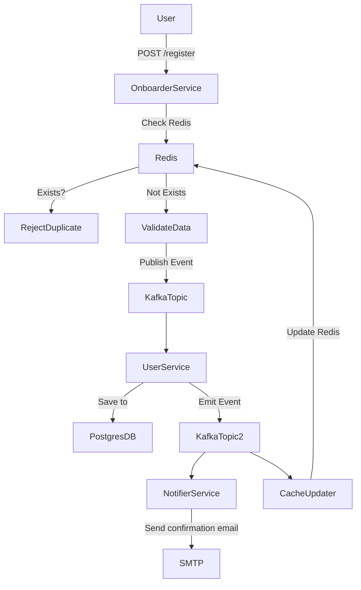
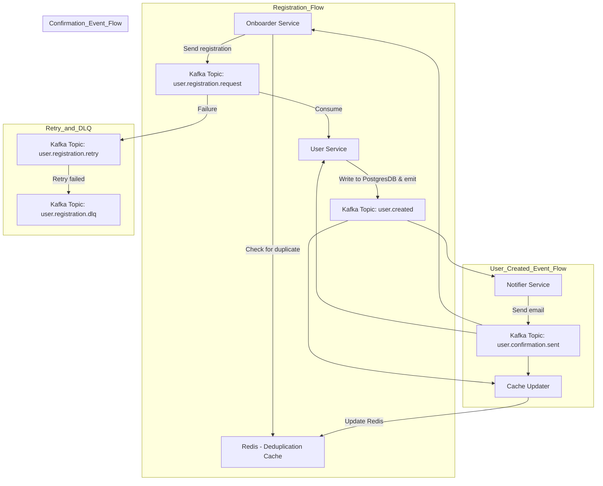
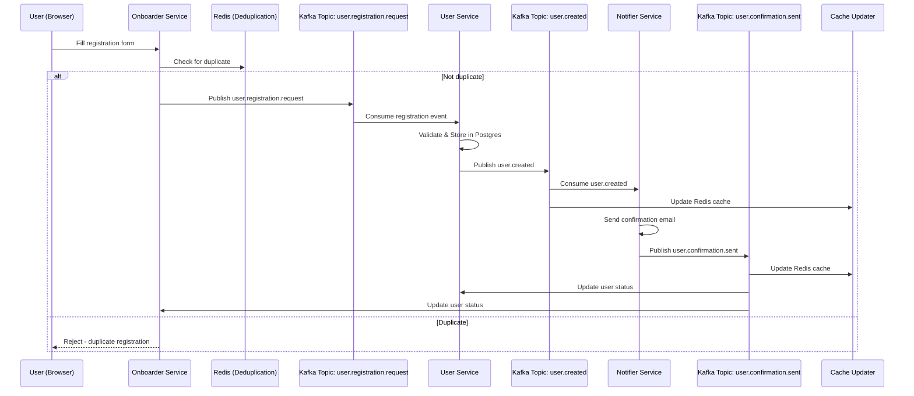
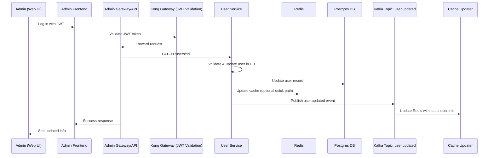

# 🏯 Jade Palace - 5 Weeks of Practices to Build "ScaleFu" System

## Overview

We are building a scalable Real-Time Registration Platform that can onboard thousands of users per second, eliminate duplicates instantly, and sustain high availability under peak loads, enhance our business processes, and provide a user-friendly interface for both users and internal staff.

## 🐼 ScaleFu Business Story

The Jade Palace is a popular shop in Thailand that has recently expanded its operations to include online membership registration. The shop has a large number of customers and wants to provide a seamless registration experience for them. The goal is to build a system that can handle high traffic, ensure data integrity, and provide a user-friendly interface for both users and internal staff.

## MVP Features

- User registration via Onboarder Service
- Admin page for user management
- User confirmation (email)


#### System Architecture

- **Onboarder Service**: Receives registration requests, validates input, and publishes to Kafka.
- **User Service**: Stores user data in PostgreSQL and triggers follow-ups.
- **Notifier Service**: Sends confirmation emails after successful registration.
- **Cache Updater**: Updates Redis cache with the latest user data.



## 5-Weeks Plan

| Week   | Focus                                           | Goals                                                                                                                                            | Deliverables                                                                                                                                                                                                                                           |
|--------|-------------------------------------------------|--------------------------------------------------------------------------------------------------------------------------------------------------|--------------------------------------------------------------------------------------------------------------------------------------------------------------------------------------------------------------------------------------------------------|
| Week 1 | Backend APIs (All Core Features)                | Build all API endpoints: Register, User Management (CRUD). System flow after register. Kafka, Redis, Postgres integration.                       | - `/api/v1/register` (POST) <br> - `/api/v1/users` (GET, PATCH, DELETE) <br> - Kafka events: user.registration, user.created, user.confirmation <br> - Redis cache setup. <br> - Database schema finalized. <br> - Complete user lifecycle in backend. |
| Week 2 | Frontend UI (Public Registration + Admin Panel) | Build 2 UIs: <br> • User: Public register page. <br> • Admin: Dashboard to manage users (view, update status). Connect frontend to backend APIs. | - Next.js app. <br> - Tailwind UI. <br> - User signup page (connects to `/register`). <br> - Admin dashboard (connects to `/users`). <br> - Basic authentication for admins.                                                                           |
| Week 3 | Deployment & Infrastructure (GCP Focus)         | Deploy backend + frontend on GCP. Use GCP Load Balancer, VPC, VM Instances / Kubernetes (flexible). Kafka and Redis hosted properly.             | - Working GCP deployment. <br> - Load balanced API. <br> - Networking knowledge: Firewall, IP, DNS, Load Balancer.                                                                                                                                     |
| Week 4 | Security (Hardening & Observability)            | Secure API & Frontend: <br> • API Gateway <br> • JWT authentication <br> • HTTPS everywhere <br> • Observability (Logging, Tracing)              | - API secured with authentication/authorization. <br> - Rate limiting. <br> - TLS certs. <br> - GCP Cloud Monitoring & Logs. <br> - Trace IDs in all services.                                                                                         |
| Week 5 | Tournament: "Take Me Down!" Challenge           | Each team load tests & attacks each other’s systems (responsibly). Try to crash or find weaknesses. Then fix and harden!                         | - Load testing reports. <br> - Bottleneck analysis. <br> - Final improved system. <br> - Award ceremony! 🏆                                                                                                                                            |

## Rules

1. Use `main` branch for development.
2. The system must be high-availability, reliable, scalable, secure, and easy to use.
3. Collaborate across teams and keep each team updated on progress. Complete each week’s objectives within the week.
4. Ensure all APIs are well-documented and follow best practices.
5. Executable documentation is required for all possible changes to the system.


## Learning Outcomes

## Week 1: Backend APIs

- **Able to build a RESTful API using Go**
  - Skills:
    - Gin framework for routing
    - Middleware for logging, authentication, and error handling
    - Context management
    - Dependency injection
    - Input validation and sanitization
    - Unit testing with Go testing framework
- **Able to implement CRUD operations in REST APIs**
  - Skills: 
    - Advanced query parameters e.g., filtering, sorting, pagination
    - Caching strategies (ETags, Last-Modified)
    - Content Types negotiation e.g., JSON vs XML
    - Rate limiting and throttling
    - Secure API design (anti-CSRF, CORS)
- **Able to connect to PostgreSQL and perform CRUD operations**
  - Skills:
    - Raw SQL queries
    - Prepared statements
    - Advanced indexes database design
    - Transactions and rollback
    - Query plan analysis (EXPLAIN)
    - Connection resilience
    - Performance tuning

- **Able to build and run services using Docker**
  - Skills:
    - Advanced Dockerfile optimizations (multi-stage builds)
    - Entrypoints vs CMD
    - Layer caching
    - BuildKit
    - Resource limits
    - Alpine vs Debian-based images
- **Able to link services using `docker-compose`**
  - Skills:
    - Complex `docker-compose` configs
    - Healthchecks
    - Named volumes/networks for data persistence and isolation
    - Inter-service dependency management
    - Environment overrides using `.env`
- **Able to design microservices that communicate via REST**
  - Skills: 
    - Advanced API versioning
    - Idempotency strategies
    - RESTful pagination and filtering
    - OpenAPI spec generation
    - Tracing across service calls
    - Circuit breakers
    - Rate limiting

- **Able to isolate responsibilities using service boundaries**
  - Skills:
    - Domain-driven service modeling
    - API gateway orchestration
    - Cross-service data integrity
    - Anti-corruption layer
    - BFF (Backend-for-Frontend) patterns

- **Able to produce and consume messages using Kafka**
  - Skills:
    - Exactly-once semantics
    - Kafka Connect
    - Schema evolution with Avro/Protobuf
    - Kafka Streams DSL
    - SASL/SSL authentication
- **Able to explain differences between synchronous and async comms**
  - Skills:
    - Latency vs throughput tradeoffs
    - Eventual consistency
    - Message ordering vs parallelism
    - Comparison of SQS/Kafka/NATS
- **Able to integrate Kafka in service pipelines for event flow**
  - Skills:
    - Kafka topic naming conventions
    - Partitioning strategy for scale
    - Stateful retries
    - DLQ and poison pill handling
    - Kafka lag monitoring
- **Able to trigger consumer logic based on events**
  - Skills:
    - Efficient consumer group management
    - Graceful shutdowns
    - Backpressure handling
    - Event replay
    - Debouncing/throttling logic

- **Able to use Redis for caching and quick data lookup**
  - Skills:
    - LRU/LFU eviction policies
    - Redis hashes/sets for composite data
    - Lua scripting
    - Pub/Sub vs Streams
    - Redis Cluster sharding
- **Able to cache inquiry results in Redis with TTL**
  - Skills:
    - Conditional caching (e.g., stale-while-revalidate)
    - Cache stampede mitigation
    - Key namespacing
    - Distributed locks (Redlock pattern)
- **Able to implement user inquiry submission from frontend to backend**
  - Skills:
    - Secure API design (anti-CSRF, CORS)
    - Graceful error messages
    - Goroutine-safe logic
    - Input sanitization
- **Able to create RESTful APIs with validation and error handling**
  - Skills:
    - Custom middleware chains
    - Context timeouts and cancellations
    - Advanced JSON unmarshalling
    - Centralized error management
    - HTTP tracing with OpenTelemetry
- **Able to store and retrieve inquiries using PostgreSQL**
  - Skills:
    - Prepared statements
    - Advanced indexes (GIN/BTREE)
    - Upserts and conflict resolution
    - JSONB querying
    - Query plan analysis (EXPLAIN)
    - Connection resilience

## 🖥 Frontend Integration

- **Able to build UI for viewing, searching, and paginating inquiries**
  - Skills: React Query (TanStack), Dynamic table components, Debounced search, Virtualized lists, Accessibility (ARIA), i18n
- **Able to connect frontend with backend via API securely**
  - Skills: Secure token storage (HttpOnly cookies vs localStorage), CSRF protection, API versioning in frontend, Retry on token expiration

## ☁️ GCP Networking

- **Able to create and configure VPCs, subnets, and firewall rules**
  - Skills: Custom route tables, Private Google access, Peering setup, VPC flow logs, Subnet isolation for security
- **Able to configure internal and external IP access on GCP**
  - Skills: Dual-stack IPs, ILB vs ELB trade-offs, Internal DNS zones, Static IP reservation and alias IPs
- **Able to set up NAT Gateway and IAP for secure access**
  - Skills: Private connectivity (VPN/Interconnect), Cloud IAP with Identity Aware Proxy roles, Per-service IAM bindings

## 📦 Kubernetes Deployment

- **Able to deploy services to GKE using manifests or Helm**
  - Skills: Helm templating best practices, Secret management (Sealed Secrets, KMS), HorizontalPodAutoscaler (HPA), Resource quotas and limits
- **Able to use namespaces, services, and ingresses properly**
  - Skills: NetworkPolicies for service-to-service control, TLS cert management via cert-manager, ExternalDNS for ingress automation
- **Able to debug deployments using `kubectl` and GKE dashboard**
  - Skills: kubelet logs, CrashLoop root cause analysis, Network debugging with `kubectl exec` + curl/nslookup, Pod disruption budgets, Event auditing

## 🔐 Security & Authentication

- **Able to implement login and logout flows using JWT**
  - Skills: JWT refresh tokens, Rotation strategies, OAuth2/OpenID Connect integration, Secure cookie vs Authorization header decisions
- **Able to securely hash and verify passwords**
  - Skills: bcrypt cost tuning, Argon2 support, Timing attack mitigation, User enumeration prevention
- **Able to verify JWT on protected endpoints**
  - Skills: JWKS endpoint parsing, Signature algorithm validation (HS256 vs RS256), Role-based access checks
- **Able to generate and verify time-limited OTPs**
  - Skills: Secure shared key management, QR code generation for OTP setup, TOTP drift handling, Brute-force lockout mechanisms
- **Able to integrate OTP as a second-factor step in login**
  - Skills: Backup codes, Step-up authentication, UX flow for MFA setup, Per-device recognition

## 🚪 API Gateway & Security

- **Able to configure Kong routes, services, and plugins**
  - Skills: Declarative config (decK), Route prioritization, Healthchecks, Path rewriting, Custom plugins via Lua
- **Able to secure APIs with API key and rate limiting using Kong**
  - Skills: Token introspection, Quota enforcement by consumer group, Plugin ordering, RBAC enforcement via OPA or ACL plugins

## 📊 Observability: Metrics

- **Able to expose Prometheus metrics in services**
  - Skills: Histogram vs Summary trade-offs, Custom label cardinality management, Multi-process metrics, Golang memory/cpu metrics
- **Able to build Grafana dashboards with real-time metrics**
  - Skills: Advanced PromQL queries, Grafana alerting with thresholds, Annotations from deployments/events, Dashboard provisioning via JSON
- **Able to add custom business metrics and labels**
  - Skills: High-cardinality metric warnings, Business logic tracing, SLIs/SLOs alignment, Label hygiene for long-term dashboards

## 🪵 Observability: Logs

- **Able to write structured logs and correlate across services**
  - Skills: Log context injection via middleware, Trace IDs & Span propagation, Redacting PII from logs, Unified log schema
- **Able to set up Loki for querying logs by service/request**
  - Skills: Loki performance tuning, LogQL with regex and line filters, Log retention policies, Cross-dashboard log integration

## 🧪 Performance Testing

- **Able to simulate load and test system limits using K6**
  - Skills: Parameterized test cases, Load modeling (ramp-up/ramp-down/stress), Threshold-based test aborts, Integration into CI pipelines
- **Able to analyze and optimize performance bottlenecks**
  - Skills: pprof for CPU/mem profiling, GCP Trace for latency visualization, Connection pool tuning, Index selection strategy, Code optimization via flamegraphs


## Week 1: Provide the API for Registration

**Objective:**  

Provide the backend API for user registration, manage input validation, and store the data in a database. Implement CRUD operations for user management.

### Business Requirements

- Create a registration API that allows new users to sign up.
- The API should accept user information such as name, email, phone number, and Thai ID.
- Validate the input data to ensure it meets the required format and criteria.
  - Name: 2 - 200 characters
  - Email: Valid email format
  - Phone number: Valid phone number format
- Users should receive a confirmation email after successful registration.
- The system should be able to handle a large number of concurrent requests without crashing or slowing down.

### Technical Requirements

- Use a RESTful API design for the registration endpoint.
- Implement input validation using Go with the Gin framework.
- Unit test the API to ensure it works as expected.
- Integration test the API to ensure it works with the database and email service.
- Use PostgreSQL to store user information.
- Use Kafka for message queuing to handle high traffic.

### API Design Specification

#### Onboarder Service

- Endpoint: `POST /api/v1/register`
  - Request Body:

    ```json
    {
      "name": "string",
      "email": "string",
      "phoneNumber": "string"
    }
    ```

  - Success Response: HTTP 201 Created

    ```json
    {
      "status": "success",
      "message": "Registration successful",
      "data": {
        "userID": "string"
      }
    }
    ```

  - Error Response: HTTP 400 Bad Request

    ```json
    {
      "status": "error",
      "message": "Invalid input data"
    }
    ```

### Event Design Specification

- Event: `user.registration.request`
  - Payload:

    ```json
    {
      "userID": "string",
      "name": "string",
      "email": "string",
      "phoneNumber": "string"
    }
    ```

  - Producer: `onboarder`
  - Description: This event is published to Kafka after a successful registration. It contains the user information.
  - Consumer: `user`
    - Description: This event is consumed by the User Service to store user information in the database.

- Event: `user.created`
  - Payload:

    ```json
    {
      "userID": "string",
      "name": "string",
      "email": "string",
      "phoneNumber": "string"
    }
    ```

  - Producer: `user`
  - Description: This event is published to Kafka after the user information is stored in the database. It contains the user information.
  - Consumer: `notifier`
    - Description: This event is consumed by the Notifier Service to send a confirmation email to the user.
  - Consumer: `cache-updater`
    - Description: This event is consumed by the Cache Updater to update the Redis cache with the latest user information.

- Event: `user.confirmation`
  - Payload:

    ```json
    {
      "userID": "string",
      "email": "string"
    }
    ```

  - Producer: `notifier`
  - Description: This event is published to Kafka after the confirmation email is sent. It contains the user information.
  - Consumer: `cache-updater`
    - Description: This event is consumed by the Cache Updater to update the Redis cache with the latest user information.
  - Consumer: `user`
    - Description: This event is consumed by the User Service to update the user status in the database.
  - Consumer: `onboarder`
    - Description: This event is consumed by the Onboarder Service to update the user status in the database.
  - Consumer: `notifier`
    - Description: This event is consumed by the Notifier Service to update the user status in the database.
  - Consumer: `cache-updater`
    - Description: This event is consumed by the Cache Updater to update the Redis cache with the latest user information.

### Event Flow Diagram



### Sequence Diagram: User Registration




### Sequence Diagram: Admin Management



#### User Service

- Endpoint: `GET /api/v1/users`
  - Description: Retrieve a list of users.
  - Query Parameters:
    - `userID`: string (optional)
  - Success Response: HTTP 200 OK

    ```json
    {
      "status": "success",
      "data": [
        {
          "userID": "string",
          "name": "string",
          "email": "string",
          "phoneNumber": "string"
        }
      ]
    }
    ```

    ```json
    {
      "status": "success",
      "data": [
        {
          "userID": "string",
          "name": "string",
          "email": "string",
          "phoneNumber": "string"
        }
      ]
    }
    ```

  - Error Response: HTTP 404 Not Found

    ```json
    {
      "status": "error",
      "message": "User not found"
    }
    ```

- Endpoint: `POST /api/v1/users`
  - Description: Create a new user.
  - Request Body:

    ```json
    {
      "name": "string",
      "email": "string",
      "phoneNumber": "string"
    }
    ```

  - Success Response: HTTP 201 Created

    ```json
    {
      "status": "success",
      "message": "User created successfully",
      "data": {
        "userID": "string"
      }
    }
    ```

  - Error Response: HTTP 400 Bad Request

    ```json
    {
      "status": "error",
      "message": "Invalid input data"
    }
    ```

- Endpoint: `PUT /api/v1/users/{userID}`
  - Description: Update user information.
  - Request Body:

    ```json
    {
      "name": "string",
      "email": "string",
      "phoneNumber": "string"
    }
    ```

  - Success Response: HTTP 200 OK

    ```json
    {
      "status": "success",
      "message": "User updated successfully"
    }
    ```

  - Error Response: HTTP 404 Not Found

    ```json
    {
      "status": "error",
      "message": "User not found"
    }
    ```

- Endpoint: `DELETE /api/v1/users/{userID}`
  - Success Response: HTTP 200 OK

    ```json
    {
      "status": "success",
      "message": "User deleted successfully"
    }
    ```

  - Error Response: HTTP 404 Not Found

    ```json
    {
      "status": "error",
      "message": "User not found"
    }
    ```


## Week 2: Provide UI for Admin to Manage Users

**Objective:**  
Provide a UI for internal staff to manage users, including viewing, updating, and deleting user information.

### Business Requirements

- Create a web-based UI for internal staff to manage users.
- The UI should allow staff to view a list of registered users.
- Staff should be able to view user details, including name, email, phone number, ID, and registration date.

### Technical Requirements
- Use the **Next.js** framework for the UI.
- Use **Tailwind CSS** for styling.
- UI should be responsive and user-friendly.
- Implement authentication and authorization for staff access.

---

## Week 3: Deploy it to GCP Cloud with Network and Load Balancing

**Objective:**  
Deploy the backend API and frontend to GCP, configure the network, and set up load balancing for high availability.

### Key Activities
- Deploy backend API using **Google Kubernetes Engine (GKE)**.
- Deploy the frontend UI using **Google Cloud Storage** (for static files) or **Google App Engine**.
- Set up **Google Cloud Load Balancer** to route traffic to the backend.
- Use **VPC** to configure the network and ensure secure communication between services.

---

## Week 4: Implement Security

**Objective:**  
Secure the backend API, frontend, and communications between services.

### Key Activities
- Implement **OAuth 2.0** or **JWT** for authentication and authorization.
- Set up **rate limiting** (e.g., 100 requests per minute per IP) to protect the API.
- Enable **HTTPS** using **SSL certificates** for secure communication.
- Use **Google Cloud IAM** to manage permissions.
- Implement **Firewall Rules** to restrict access to services.

---

## Week 5: System "Take Me Down" Tournament

**Objective:**  
Teams will try to stress test or find bugs in other teams' systems! (🏆)

<details> 
<summary>Rules</summary>
Attack only by:

- High load (load testing / DDOS simulation).
- Trying invalid inputs (SQL injection, malformed payloads).
- Exploring bad API security or session bugs.
- No manual breaking (ssh-ing into other servers etc).
- Document any weaknesses found.

Team with the most resilient system wins!
</details>

<details open> 
<summary>Technical Requirements</summary>

### Overview
Use tools like:
- **k6**, **Artillery.io** for load testing.
- **OWASP ZAP** for security testing.
- **Curl**, **Postman** for manual attempts.

### Monitor system health:
- CPU/Memory under load.
- Auto-scaling behavior.
- Error rates.

### Presentation:
Each team presents their findings and defense strategies.

</details>


## 📚 Topics & Resources by Category
🧱 Microservices & Messaging
Kafka: Confluent Kafka 101

Redis: Redis Streams vs PubSub

Postgres: Indexing, transactions, schema design

Patterns: Clean architecture, eventual consistency, idempotency

🔐 Auth & Security
JWT: Auth0’s guide: https://jwt.io/introduction/

Kong Gateway: Kong Docs

Password security: Argon2 / bcrypt usage

🧰 DevOps & Cloud
GCP + GKE: Google Cloud skill badges

Kubernetes: Learn Kubernetes in a Month of Lunches

ArgoCD: Getting Started

GitLab CI/CD: GitLab Pipelines Docs

🔭 Observability & Scaling
Grafana + Prometheus: Grafana Labs Getting Started

k6 Load Testing: https://k6.io/docs/

Rate limiting: Implemented via Kong and optionally Redis


## P'Lek
- Udemy GCP course
- Udemy Kubernetes course